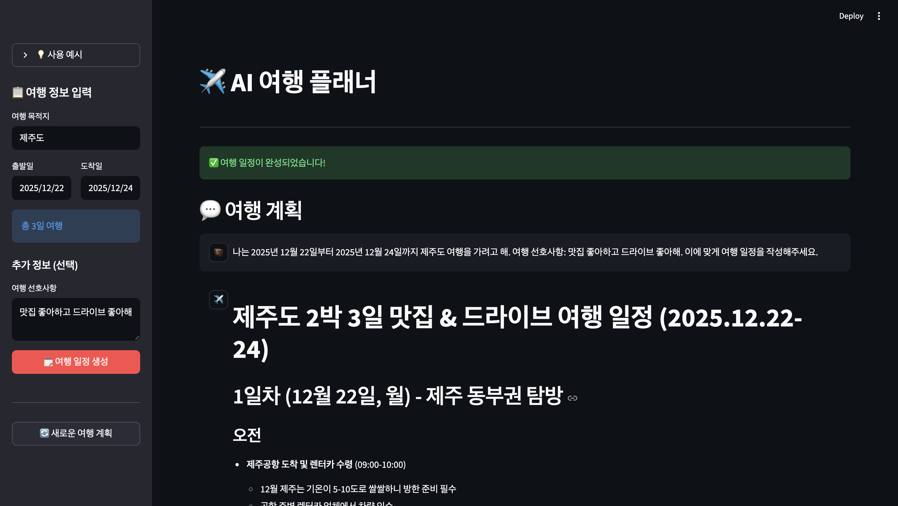

# ✈️ AI 여행 플래너

LangGraph와 Anthropic Claude를 활용한 맞춤형 여행 일정 생성 애플리케이션

## 주요 기능

- **자동 여행 정보 수집**: Tavily 검색을 통해 여행지 관련 정보 자동 조사
- **맞춤형 일정 생성**: AI가 수집한 정보를 바탕으로 사용자 맞춤 여행 일정 작성
- **실시간 진행 상황**: 정보 수집 및 일정 작성 과정을 실시간으로 확인
- **직관적인 인터페이스**: Streamlit 기반의 깔끔하고 사용하기 쉬운 UI

## 프리뷰



## How to run

### 1. 필수 요구사항

- Python 3.8 이상
- Anthropic API Key
- Tavily API Key

### 2. 설치

```bash
# 필요한 패키지 설치
pip install -r requirements.txt
```

### 3. 환경 설정

프로젝트 루트에 `.env` 파일을 생성하고 다음 내용을 추가하세요:

```env
ANTHROPIC_API_KEY=your_anthropic_api_key
TAVILY_API_KEY=your_tavily_api_key
```

### 4. 실행

```bash
streamlit run app.py
```


## How to use

1. **여행 정보 입력**
   - 여행 목적지 입력 (예: 제주도, 파리, 도쿄)
   - 출발일과 도착일 선택
   - 선호사항 입력 (선택사항)

2. **일정 생성**
   - "🗓️ 여행 일정 생성" 버튼 클릭
   - AI가 자동으로 정보를 수집하고 일정을 작성합니다

3. **결과 확인**
   - 채팅 형식으로 생성된 여행 일정 확인
   - 필요시 "🔄 새로운 여행 계획" 버튼으로 초기화

## 🏗️ 프로젝트 구조

```
travel_agent/
├── .env               # 환경 변수 (API 키)
├── README.md          # 프로젝트 설명
├── app.py              # Streamlit UI 애플리케이션
└── travel_agent.py     # LangGraph 에이전트 로직
```

## 기술 스택

- **LangGraph**: AI 에이전트 워크플로우 관리
- **Anthropic Claude**: 고성능 언어 모델 (claude-3-7-sonnet-latest)
- **Tavily Search**: 실시간 웹 검색 API
- **Streamlit**: 웹 애플리케이션 프레임워크
- **LangChain**: AI 애플리케이션 개발 프레임워크

## 에이전트 아키텍처

이 프로젝트는 두 개의 전문화된 AI 에이전트로 구성된 순차적 워크플로우를 사용합니다:

1. **Research Agent** (연구 에이전트)
   - 여행 목적지와 기간을 바탕으로 검색어 생성
   - Tavily를 통해 관련 정보 수집
   - 상위 10개 결과를 요약하여 다음 에이전트에 전달

2. **Planner Agent** (기획 에이전트)
   - 수집된 정보를 분석
   - 사용자 맞춤형 여행 일정 작성
   - 추천 활동 및 숙박시설 포함